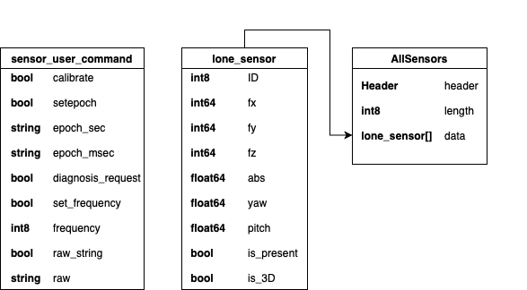

# ROS2 version of ths FTS Sensor Package 

# FEATURES 

This package features are the following :
  - Reading sensor values in cartesian coordinates through ROS messages (AllSensors messages)
  - Reading sensor values in spherical coordinates through ROS messages (AllSensors messages)
  - Sending commands to the sensors through ROS messages (sensor_user_command messages)

The use of the sensor_user_command messages will be done in the next section.

# MESSAGE STRUCTURE
Here is the structure of the ROS messages used in this package

If you want to read informations about the sensors, then you must code a Node that Subscribes to the "R_AllSensors" Topic if you are using a Right Hand, or to the "L_AllSensors" Topic if you use a Left Hand. There are user samples that show how to do so.

If you want to send commands to the sensor, then you must code a Node that Publishes to the "R/L_sensor_user_command" Topic (R or L still depends if you are using a Right or Left hand). Then, create an instance of the sensor_user_command class as done in the user_samples 3 and 4. Here is an explanation of the sensor_user_command fields :
  - To calibrate the sensor, set the "calibrate" value to "true"
  - To set sensors epoch : set the "setepoch" value to "true", the "epoch_sec" value to the epoch's seconds you want and the "epoch_msec" value to the epochs milliseconds you want.
  - To send a diagnosis request, set the "diagnosis_request" value to "true". The answer will be saved in ROS logs
  - To change frequency, set the "set_frequency" value to "true" and the "frequency" value to the frequency you want between 1 and 50
  - To send a custom command, set the "raw_string" value to "true" and the "raw" value to the command you want to send. This is usually a debug feature.

# USER SAMPLES FOR SENSOR_PKG 
As said, there are 4 user code samples for you to have to examples on how to interact with the sensor_pkg package.
Each one of them initialize a ROS Node to communicate with the relevant Topic.
These examples are located in the src/sensor_pkg/user_example folder.

The first one is user_sample_1_read_values.py. This script first sends a command to calibrate the sensors. Then it gets data from the sensors about the force on the X, Y and Z axis and display them on the terminal as they are received.

The second one is user_sample_2_abs_pitch_yaw.py. This script does the same as the first one, but instead of using the cartesian coordinates data, it uses the spherical coordinates data (abs, yaw, pitch).

The third one is user_sample_3_setfreq_calibrate.py. This script sends a command to the sensor in order to calibrate them and set the output frequency to 20Hz.

The fourth one is user_sample_4_diagnosis_request.py. This script simply sends a diagnosis request to the sensor.

The best way learn how to use the SENSOR_PKG is to play a bit with these samples and understand how to interact with the sensors data